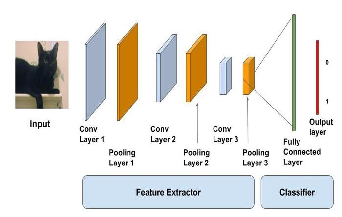
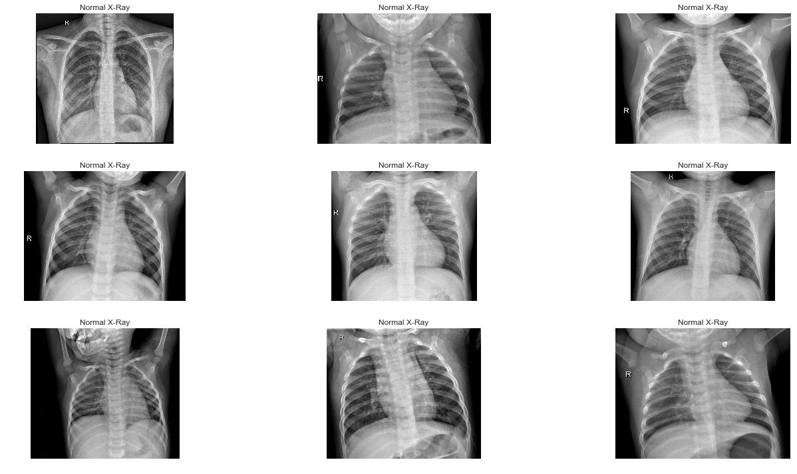
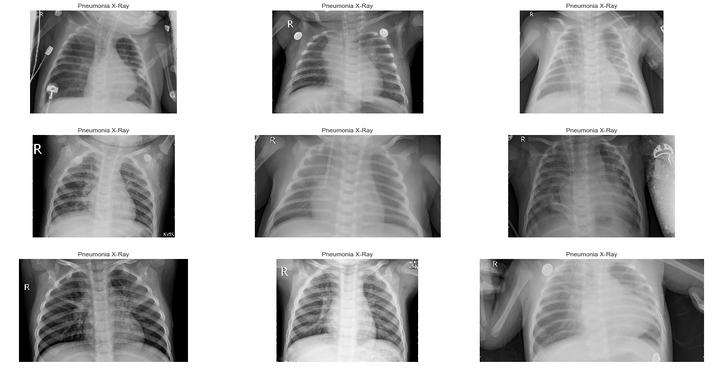
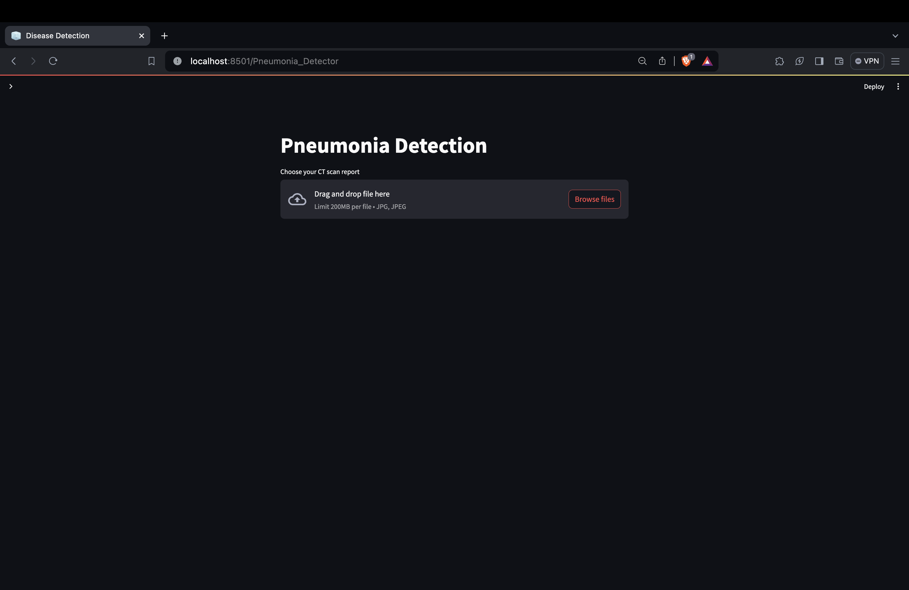
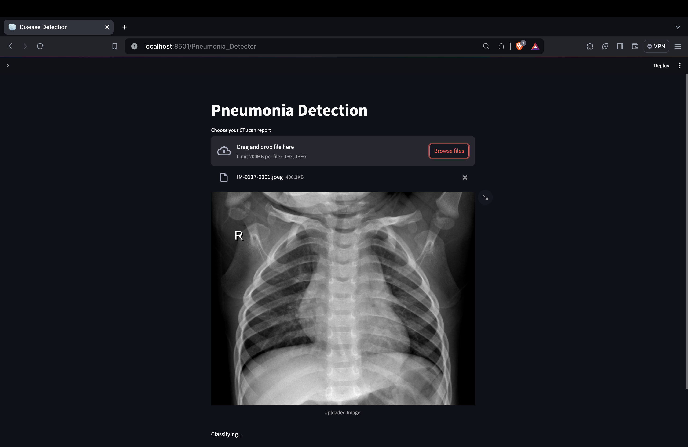
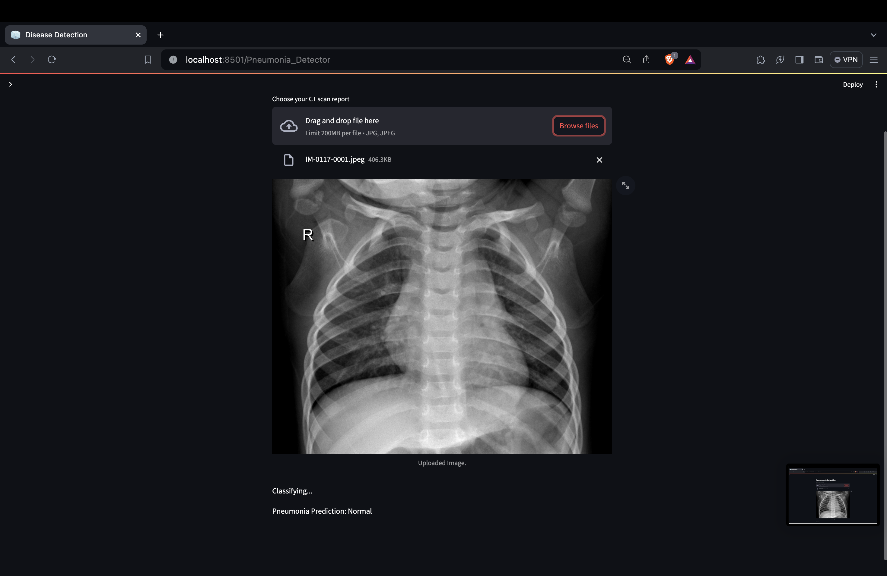

# **MedAnal-Pneumonia Detection with Deep Learning**

Welcome to MedAnal, an innovative deep learning project that uses convolutional neural networks (CNNs) to analyze chest X-ray images and detect the presence of pneumonia. This project aims to assist healthcare professionals in diagnosing pneumonia more efficiently and accurately.

# About
Pneumonia is a common and potentially life-threatening condition that affects millions of people worldwide each year. Pneumonia is estimated to account for around 15% of all deaths of children under 5 years old, making it one of the leading causes of death in this age group. In older adults and individuals with compromised immune systems, pneumonia can also contribute significantly to mortality rates. Early and accurate diagnosis is crucial for effective treatment and patient outcomes. MedAnal leverages the power of deep learning to automate the process of pneumonia detection, enabling faster and more reliable diagnosis.
Link for more information of the project: [Presentation](https://drive.google.com/file/d/1WQRQAqC3I8qbNXrv_SVovR2VEc9sNdvq/view?usp=sharing)

## Problems faced by a person when he gets an X-ray and struggles to understand it, or when doctors face challenges in interpreting X-ray images, several factors could be at play:
- X-ray images can be complex, with subtle shades of gray representing different tissues and structures. Understanding these nuances requires training and experience.
- Pneumonia, for example, can present in various ways on an X-ray, depending on factors such as the stage of infection and the patient's underlying health conditions. This variability can make it challenging to diagnose accurately.
- Some conditions can mimic the appearance of pneumonia on an X-ray, leading to misinterpretation. Distinguishing between these conditions requires careful analysis.
- Poor image quality, such as blurriness or inadequate exposure, can make it difficult to visualize key structures and abnormalities, further complicating interpretation.
- Interpretation of X-rays can be subjective to some extent, leading to differences in opinion among radiologists and healthcare providers.
- In some cases, limited access to radiologists or specialists who are experienced in interpreting X-rays can result in delays or errors in diagnosis.

# Features

- ### Deep Learning Model:
  MedAnal utilizes a state-of-the-art CNN architecture trained on a large dataset of chest X-ray images to accurately detect pneumonia.
  
- ### Web Application:
  MedAnal provides a user-friendly web interface for uploading X-ray images and obtaining real-time results.
- ### Fast and Efficient:
  With MedAnal, healthcare professionals can quickly analyze X-ray images and make informed decisions about patient care.
- ### Scalable:
  The deep learning model can be easily scaled to analyze large volumes of X-ray images, making it suitable for a wide range of healthcare settings.
  
  
  

# Getting Started
# How To Use?
1. Upload a chest X-ray image to the web application.
2. Click the "Get Started" button to get started and then drop the image to process the image.
3. MedAnal will analyze the image and display the results, indicating whether pneumonia is present.

# Contributions
Contributions to MedAnal are welcome! If you have ideas for improving the deep learning model, enhancing the web application, or adding new features, please feel free to submit a pull request.

# Acknowledgements
We would like to thank the developers and contributors of the deep learning frameworks and libraries used in this project, as well as the creators of the datasets used for training and evaluation.
